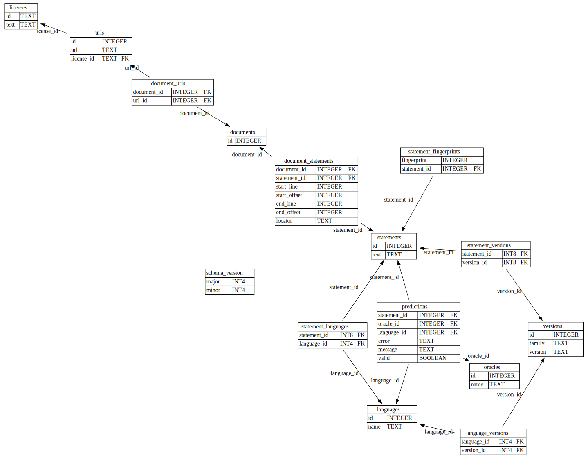

# SQL Parser Tests

These tools collect a corpus of SQL-like statements in a variety of languages, then use a series of oracles to predict whether each statement is valid in a given language.

Currently postgres-specific.

Note that this is alpha-quality software: oracle output may fail to be correctly interpreted, and APIs may change rapidly (i.e CLIs + ./schema.sql).
Even when this is stable, not that oracle predictions may be ambiguous.

## Oracle testing

<!--
```
 (=======)
  :||||:
  |||||||
  :|:||||
  |||||:
   ||||||
  |:|||||
  |||||||
   |||: |
 (= = = =)
``` -->

In this repo, "oracle" refers to a black box which issues truthful predictions about a program's behavior, _not_ Oracle the lawsuit-issuing corporation.

Oracle-testing is a black-box testing method which gives limited insight into whether any given statement is valid. Using oracles to predict syntax validity is easier than deriving parsing tests from the numerous specifications of SQL dialects and sql-like languages.

## Usage: Consuming a test suite

Download one of the databases from the [the last step of a successful ci run](https://github.com/SKalt/pg_sql_parser_tests/actions)
, then query the statements and oracle output using sqlite. You can [find the sqlite database schema](./schema.sql) in the root of this repo.
See also also [`./pkg/corpus/sql/get_predictions.sql`](./pkg/corpus/sql/get_predictions.sql), which demonstrates how you'd join together the table to retrieve predictions.



### Contributing

If you'd like to contribute new oracles, sources of SQL, documentation, or fixes, see [./CONTRIBUTING.md](./CONTRIBUTING.md).

# License

BSD 3-clause; see [./LICENSE](./LICENSE)

# Directory structure

```
.
├── pkg/
|   ├── corpus/ # tools for interacting with the test-corpus database
|   └── oracles/                       # defines the oracle interface
|       └── ${database}/${oracle}/*.go # individual oracles
├── scripts
|   ├── parse/    # output pg_query AST for sanity-checking oracle results
|   ├── splitter/ # create a sql-statement-corpus database
|   └── predict/  # runs oracles over an existing corpus database
├── docker-compose.yaml # for defining database-services for use by oracles
├── Earthfile,Makefile # build tool
├── go.mod,go.sum,Cargo.toml,Cargo.lock # package management
└── README.md
```
